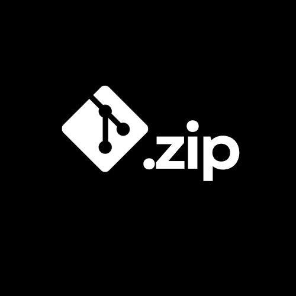
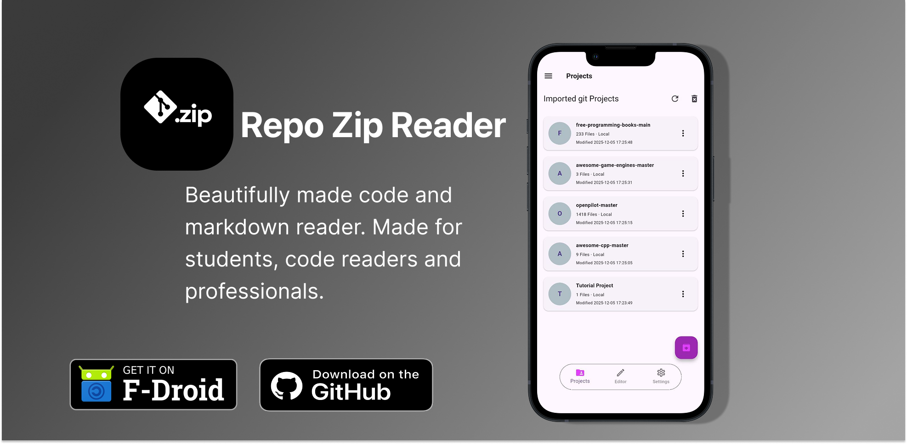
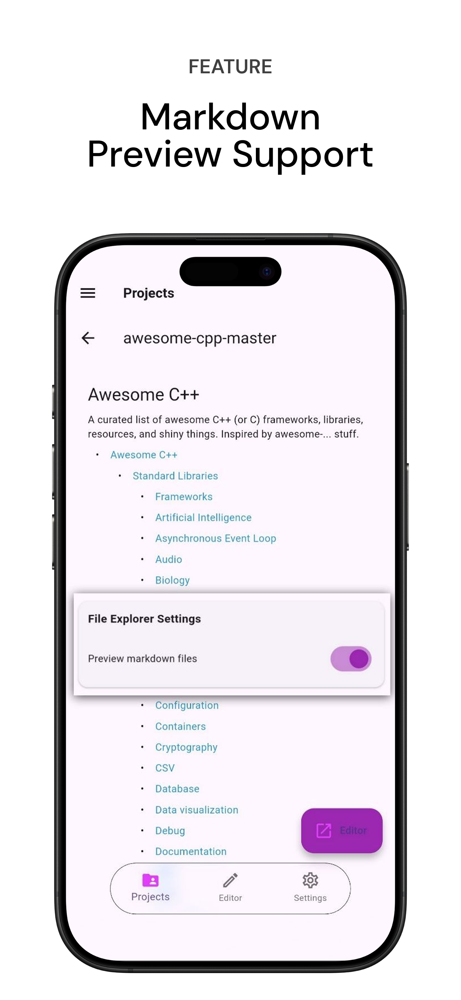
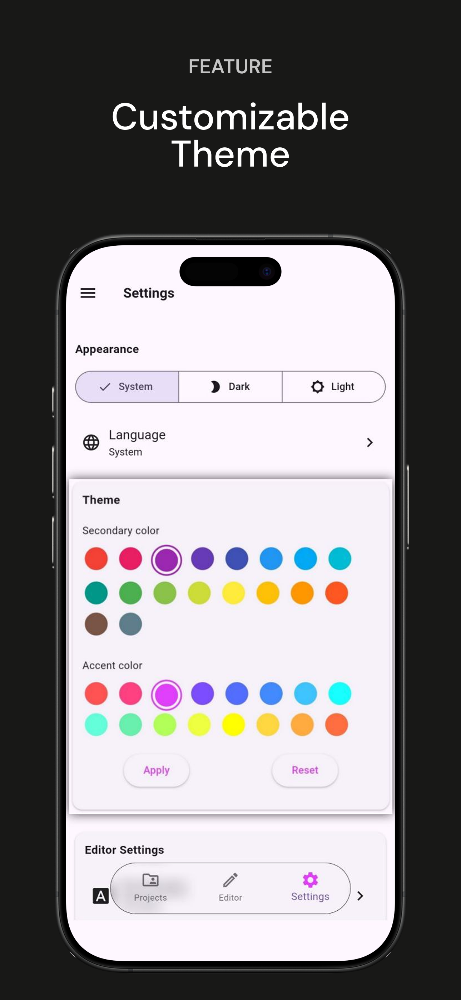

 

  

<h1 align="center">Repo Zip Reader (RZR)</h1>

  
  
  
  
  

A mobile code reader for reading git projects in a code editor. Download source code from GitHub, GitLab or Bitbucket in "owner/repo" format and read it on the go.

  

<table border="1">
  <tr>
    <th>OS</th>
    <th>Source</th>
  </tr>
  <tr>
    <td>Android</td>
    <td>
    
      
    </td>
  </tr>
  <tr>
  <td>iOS (unsigned)</td>
  <td>
  
  </td>
  </tr>
</table>
 

Explore any Github, Gitlab or Bitbucket repository – just download it as a .zip and open it instantly in a beautiful, read-only code editor.

## Features

- Download GitHub, GitLab and Bitbucket repositories as zip archives.
- Read source code in the Monaco editor with support for 100+ programming languages. Customizable with plugins.
- Browse extracted projects with an in-app folder and file tree.
- Read-only code editor with Monaco syntax highlighting (via WebView).
- Preview READMEs and `.md` files instantly.
- Customize file explorer and editor options such as word wrap, minimap, line numbers, and zoom.
- Supports English and 13 other languages.

The app uses the INTERNET permission only to download repository archives. No tracking or analytics.

| Imported Projects          | Zip Manager         |
|----------------------------|----------------------------|
|  |  |

| Markdown Previewer         | Code Editor                |
|----------------------------|----------------------------|
|  |  |

| Advanced Options           | Customizable Theme         |
|----------------------------|----------------------------|
|  |  |

## How to Use

1. Download any repository as `.zip` from GitHub, GitLab, etc.
2. Open **Repo Zip Reader (RZR)**
3. Tap **Import Project** → select your `.zip` file
4. Wait for extraction (progress shown for large projects)
5. Browse, search, and read code offline!

## Privacy & Permissions

- Read our Privacy policy, [view here](https://bilalsul.github.io/rzr/privacy)
- Terms of Use, [view here](https://bilalsul.github.io/rzr/terms)
- The app uses the INTERNET permission to download repository archives and check for new versions on GitHub
- No tracking, no analytics

---

**Repo Zip Reader (RZR)** – View code anywhere, anytime.  

📱 [Get the latest APK release](https://github.com/bilalsul/rzr/releases/latest)

## License

This project is licensed under the [GNU 3.0 License](./LICENSE).

## Contributing

Want to help? See the [Contributing Guide](./CONTRIBUTING.md) for how to set up the project, run it locally, add or translate strings, and open a pull request.

## Thanks

[flutter_monaco](https://github.com/omar-hanafy/flutter_monaco), which is MIT licensed, a flutter plugin for integrating the Monaco Editor (VS Code's editor) into Flutter applications via WebView.

[Anx Reader](https://github.com/Anxcye/anx-reader), MIT licensed Ebook Reader, thanks for the UI inspiration and such a plugin rich reading app. RZR UI is a reflection of this Cool Project.

And many [other open source projects](./pubspec.yaml), thanks to all the authors for their contributions.
