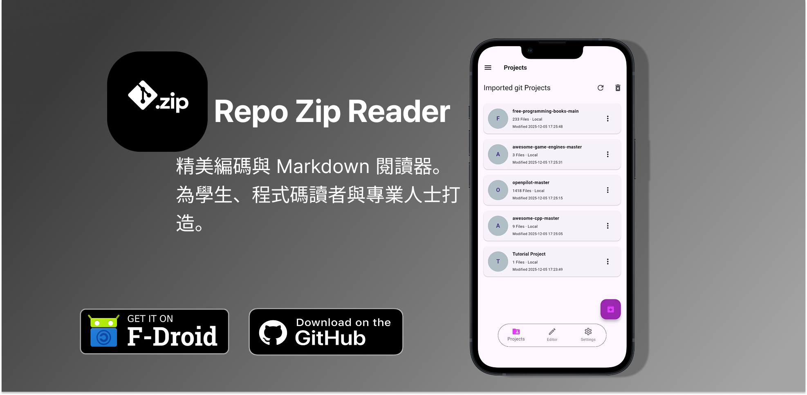
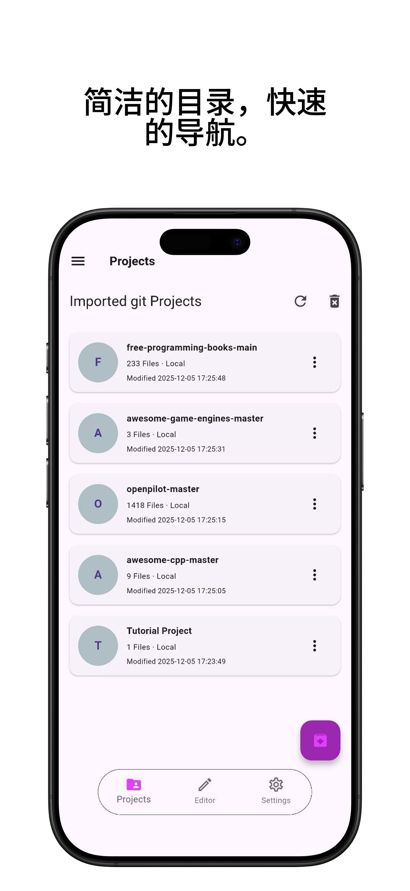
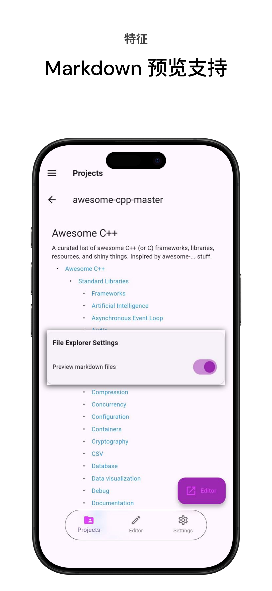
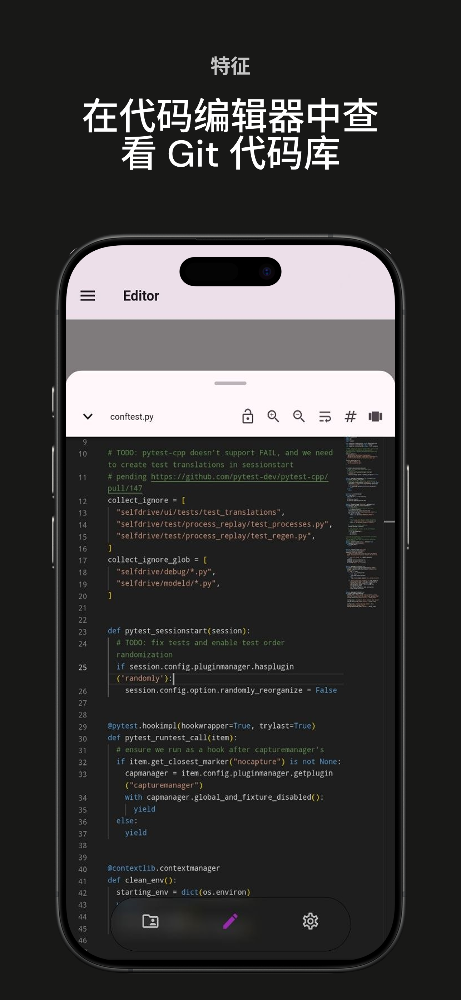
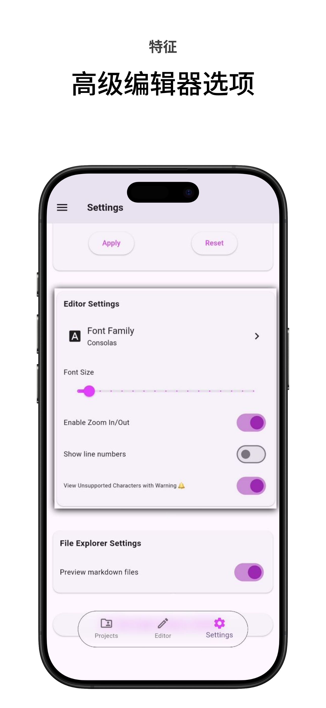
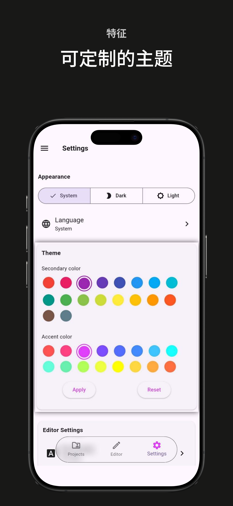
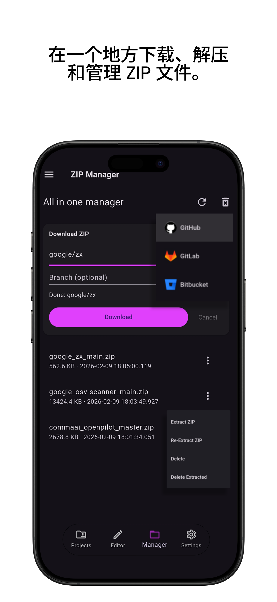

**简体中文** | [English](README.md)

 

  

<h1 align="center">Repo Zip Reader (RZR)</h1>

  
  
  
  

一款在代码编辑器中阅读 git 项目的移动端代码阅读器。以 "owner/repo" 格式从 GitHub、GitLab 或 Bitbucket 下载源代码，随时随地进行阅读。

  

<table border="1">
  <tr>
    <th>操作系统</th>
    <th>来源</th>
  </tr>
  <tr>
    <td>Android</td>
    <td>
    <a href="https://f-droid.org/packages/bilalsul.rzr">
    
      
    </td>
  </tr>
</table>
 

探索任何 Github、Gitlab 或 Bitbucket 仓库 – 只需将其下载为 .zip 文件，即可在精美的只读代码编辑器中立即打开。

## 功能

- 通过内置的 Zip 管理器插件，将 GitHub、GitLab 和 Bitbucket 仓库下载为 zip。
- 在 Monaco 编辑器中阅读源代码，支持 100 多种编程语言，可通过插件自定义。
- 应用内文件夹/文件树浏览器，用于管理解压后的 zip 项目（启用后可用）。
- 只读代码编辑器，支持 Monaco 语法高亮（通过 WebView）。
- README 和 `.md` 文件的即时 Markdown 预览（启用后可用）。
- 丰富设置，可通过插件系统管理文件浏览器和编辑器选项（自动换行、缩略图、行号、缩放）。
- 支持英语及其他 13 种语言。
应用仅使用 INTERNET 权限下载仓库压缩包。无跟踪、无分析。

| 已导入项目 | 插件管理器 |
|--------------------------|-----------------|
|  |  |

| Markdown 预览器 | 代码编辑器 |
|---------------------|------------------|
|  |  |

| 高级选项 | 可自定义主题 |
|--------------------|-----------------|
|  |  |

| ZIP 管理器 |
|------------------|
|  |

## 如何使用

1. 从 GitHub、GitLab 等下载任何仓库为 `.zip` 文件。
2. 打开 **Repo Zip Reader (RZR)**
3. 点击 **导入项目** → 选择您的 `.zip` 文件
4. 等待提取（大型项目显示进度）
5. 离线浏览、搜索和阅读代码！

## 隐私与权限

- 阅读我们的隐私政策，[查看这里](https://bilalsul.github.io/rzr/privacy)
- 使用条款，[查看这里](https://bilalsul.github.io/rzr/terms)
- 应用使用 INTERNET 权限来下载仓库压缩包并在 GitHub 上检查新版本
- 无跟踪、无分析

---

**Repo Zip Reader (RZR)** – 随时随地查看代码。  

📱 [获取最新 APK 版本](https://github.com/bilalsul/rzr/releases/latest)

## 许可证

本项目采用 [GNU 3.0 许可证](./LICENSE)。

## 贡献

想参与贡献？请参阅 [贡献指南](./CONTRIBUTING.md)，了解如何搭建项目、本地运行、添加或翻译字符串以及提交拉取请求。

## 致谢

[flutter_monaco](https://github.com/omar-hanafy/flutter_monaco)，采用 MIT 许可证，是一个用于将 Monaco 编辑器（VS Code 的编辑器）通过 WebView 集成到 Flutter 应用程序中的 Flutter 插件。

[Anx Reader](https://github.com/Anxcye/anx-reader)，采用 MIT 许可证的电子书阅读器，感谢 UI 灵感和如此插件丰富的阅读应用。RZR 的 UI 是这个酷项目的反映。

以及许多 [其他开源项目](./pubspec.yaml)，感谢所有作者的贡献。
