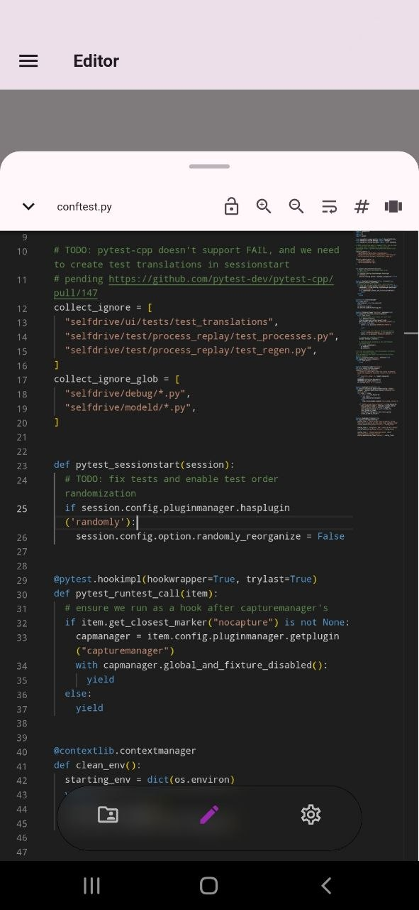

RZV embeds a read-only code editor based on the [Monaco Editor](https://github.com/omar-hanafy/flutter_monaco), the same editor used by Visual Studio Code.

## 3.1 Syntax Highlighting

When you open a source file, RZV automatically detects the programming language and applies syntax highlighting. Many common languages are supported out of the box.

The editor is read-only: you can browse and study the code, but you cannot modify the repository files.

## 3.2 Editor Options

Several editor options can be toggled from the **Plugins** system or the editor toolbar:

- word wrap
- minimap
- line numbers
- zoom in/out
- code folding
- bracket matching
- render control characters

## 3.3 Font Size and Font Family

You can customize the editor font size and font family to suit your reading preferences. Zoom in/out is also available to quickly adjust the view while reading.
