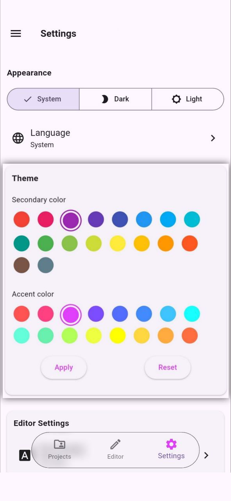
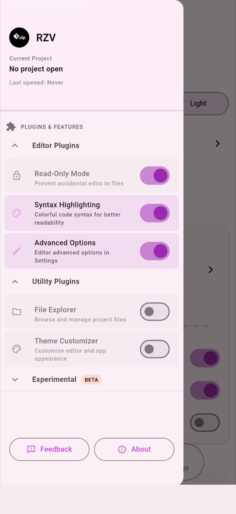
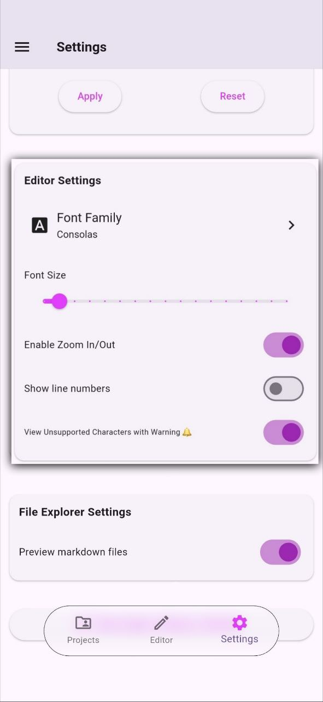

RZV is highly customizable to fit your reading preferences.

## 5.1 Themes and Accent Colors

You can choose between light and dark themes, as well as customize the secondary and accent colors used across the app. The theme customizer can be enabled from the **Plugins** system.

## 5.2 Plugins System

RZV features a plugins system which lets you toggle individual features on and off:

- file explorer
- markdown preview
- syntax highlighting
- code folding
- bracket matching
- editor zoom in/out
- line numbers
- minimap
- render control characters
- word wrap
- advanced editor options
- theme customizer

Enabled plugins are reflected in the bottom navigation bar, so you only see the features you actually use.

## 5.3 Interface Languages

RZV supports 14 interface languages: English, Italian, French, German, Arabic, Spanish, Portuguese, Turkish, Chinese (Simplified & Traditional), Japanese, Korean and Russian. The app detects your device language and falls back to English when the language is not supported. Please update/support your language by creating [a pull request](https://github.com/bilalsul/rzv/pulls).
