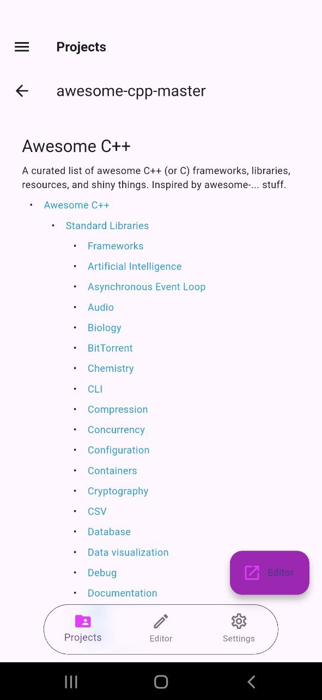

RZR renders Markdown files so you can read documentation and READMEs the way they are meant to be read.

## 4.1 Previewing README files

Tap a `README.md` (or any `.md` file) in the file tree to see it rendered as formatted text, including headings, lists, links, code blocks and images.

## 4.2 Preview Settings

Markdown preview is available from the file tree for README and `.md` files.
