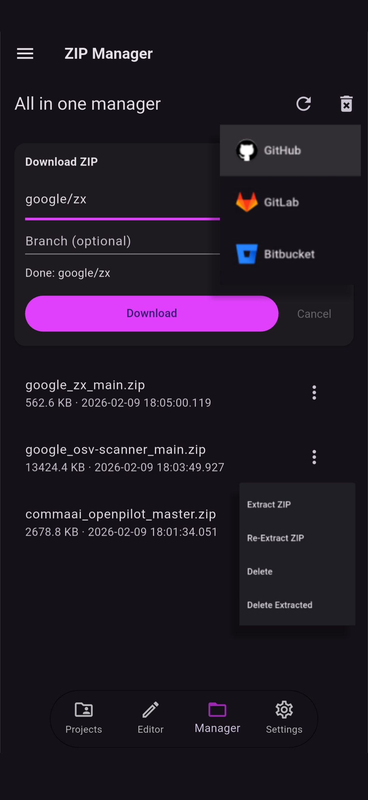
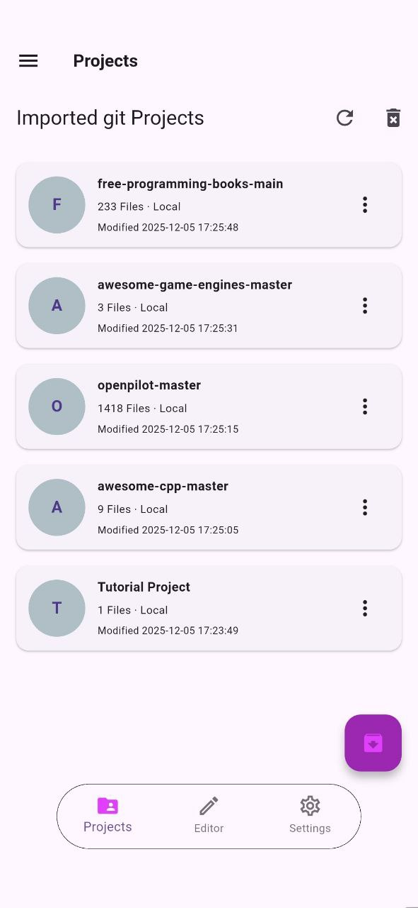

The Zip Manager is a built-in downloader which lets you fetch a repository archive directly from GitHub, GitLab or Bitbucket and extract it, without leaving the app.

## 2.1 Downloading a Repository

From the Zip Manager Tab, select the provider (GitHub, GitLab or Bitbucket), enter the repository URL or `owner/name`, and start the download. RZR downloads the repository as a `.zip` archive and extracts it automatically.

Downloads can be cancelled at any time. After a cancellation, RZR allows you to start another download right away.

## 2.2 Branch Selection

Before downloading, you can select the branch to download. RZR uses the repository default branch when none is selected, but you can pick a specific branch from the available ones.

## 2.3 Extract Projects

Once the archive is downloaded, you can extract it below, the project is then added in the projects tab alongside the other imported projects. From there you can open it, rename it, or delete it when you no longer need it. You can refresh above if the extracted project is not showing.

